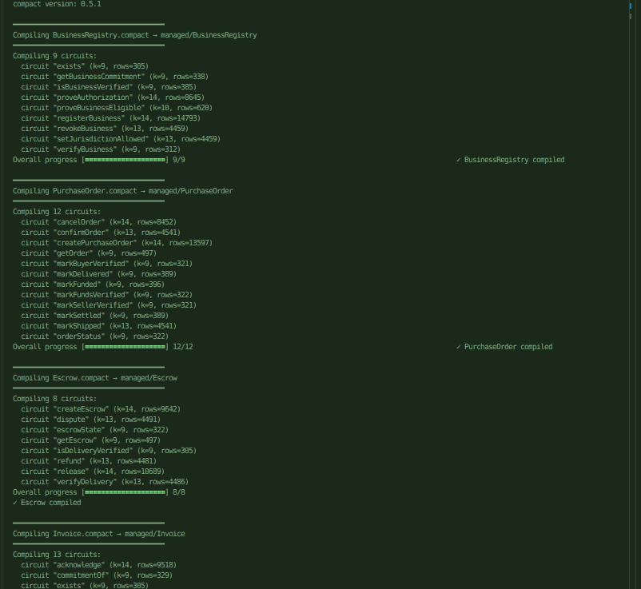
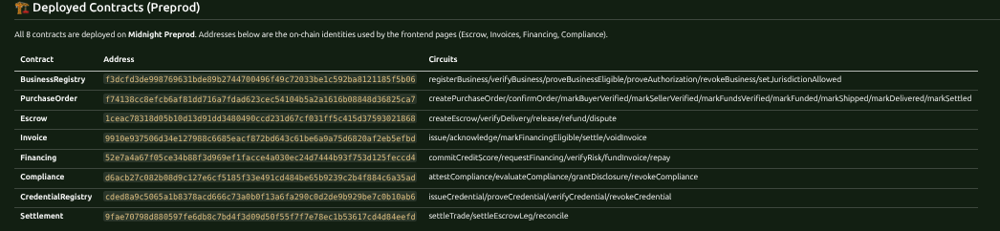

[](https://app.akindo.io/wave-hacks/jaMZjqPOBsLXvjdG)

# VeilCommerce

> **Private financial infrastructure for global commerce.**
>
> **Trade globally. Reveal less.**

[](https://midnight.network)
[](https://typescriptlang.org)
[](https://react.dev)
[](https://vitejs.dev)
[](LICENSE)

---

## 🎯 What is VeilCommerce?

VeilCommerce is a **privacy-preserving B2B commerce platform** built on the **Midnight blockchain**. It enables businesses to transact, escrow, invoice, and finance trade **without exposing commercially sensitive information**.

### The Problem

Global commerce requires trust between strangers. Today, that trust demands total transparency:

- Bank statements
- Customer lists
- Supplier contracts
- Financial records
- Inventory levels

### The Solution

**Prove what matters without revealing everything else.**

| Instead of revealing... | VeilCommerce proves...    |
| ----------------------- | ------------------------- |
| Exact bank balance      | ✓ Funds ≥ $50,000         |
| Full customer list      | ✓ Business verified in NG |
| Exact inventory         | ✓ Stock ≥ 10,000 units    |
| Credit score            | ✓ Score ≥ 650             |
| Financial history       | ✓ Compliance score ≥ 70   |

---

## ✨ Features

### 🔐 Core Modules

| Module                 | Description                                | Midnight Pattern                                  |
| ---------------------- | ------------------------------------------ | ------------------------------------------------- |
| **BusinessRegistry**   | Private business identity + verification   | Credence (domain-separated keys, nullifiers)      |
| **PurchaseOrder**      | Private PO lifecycle with ZK-gated flags   | dMarket (commitments, state machine)              |
| **Escrow**             | Conditional payment with ZK release        | Midnight Escrow (persistentCommit, nullifiers)    |
| **Invoice**            | Verified private receivable                | Privoice (commitment, acknowledgment, settlement) |
| **Financing**          | Private invoice financing + risk proof     | Kredz (ScoreData hash, prove_tier) + RWA          |
| **Compliance**         | Programmable ZK compliance                 | ZK-Judge (weighted scoring) + DPO2U               |
| **Settlement**         | Final settlement record                    | Custom (nullifier-gated)                          |
| **CredentialRegistry** | Private credentials + selective disclosure | Credence (presentation nullifiers)                |

### 🛡️ Privacy Guarantees

- **No private data on-chain** — only `persistentHash` commitments
- **No linkability across roles** — domain-separated key derivation
- **No replay of authorizations** — nullifier sets per action
- **Auditable when authorized** — selective disclosure via ZK

---

## 🔒 Public State vs Private Witness

VeilCommerce is built on Midnight's dual-state model. **Private witnesses** never leave your device — **public state** only stores commitments, flags and nullifiers. Circuits bridge the two with `persistentHash` + `disclose()`.

### Public state — on-chain, visible to everyone

Stored in Compact `ledger` (`Map`/`Set`/`Counter`) and disclosed via `disclose()`. Readable by anyone via `queryVeilLedger` + indexer.

- **Commitments, not preimages** — e.g. `contracts/Escrow.compact:46-50` `escrows: Map<Bytes32,EscrowRecord>` holds `amountCommit`/`releaseCommit` (`persistentHash(AmountData)` `contracts/Escrow.compact:66-69`), `contracts/Invoice.compact:36-37` `invoices: Map<Bytes32,Bytes32>` holds `termsCommitment(amount,buyer,memo,salt)` `contracts/Invoice.compact:68-76`
- **State & flags** — `EscrowState {Funded, DeliveryVerified, Released}` `contracts/Escrow.compact:21`, `InvoiceStatus`, `acknowledged/settled/voided/financingEligible` sets, `deliveryVerified` set
- **Nullifiers & counters** — `usedReleaseNullifiers` `contracts/Escrow.compact:49`, `totalEscrows`/`totalInvoices` — prevents replay without linking to identity
- **Derived IDs** — `derivePartyId(sk)=persistentHash(["veil:escrow:party:v1", sk.bytes])` `contracts/Escrow.compact:59-63`, `issuerId` `contracts/Invoice.compact:54`

Anyone can query: `await queryVeilLedger("Escrow","1ceac7...")` → `{ escrows, totalEscrows }` but learns only `✓ sufficient / ✓ verified`, never the preimage.

### Private witness — off-chain, yours only

Supplied per-call via `witness` functions, stored in `privateStateProvider` (`levelPrivateStateProvider` pattern). Never disclosed, only used inside the prover.

Defined in `frontend/src/midnight/witnesses.ts:53-56,47-51`:

```compact
// contracts declare what they need — frontend provides it
witness getPartySecret(): PartySecret;      // contracts/Escrow.compact:53
witness privateAmount(): Uint64;            // contracts/Escrow.compact:56
witness localAmount(): Uint64;              // contracts/Invoice.compact:48
witness localBuyer(): Bytes32;              // contracts/Invoice.compact:49
witness localSalt(): Bytes32;               // contracts/Invoice.compact:51
```

```ts
// frontend/src/midnight/witnesses.ts:9 — [privateState, witnessValue]
export function partySecretWitness(ctx): [state, { bytes: Uint8Array }] {
  const secret = ctx.privateState.partySecret ?? persistentSecret("party"); // crypto.getRandomValues(32) + localStorage veil:identity:*
  return [{ ...ctx.privateState, partySecret: secret }, { bytes: secret }];
}
```

Persisted per-role across calls (`veil:identity:*` in `localStorage` + module cache `frontend/src/midnight/witnesses.ts:170-214`) so the same wallet derives stable `businessId / partyId / issuerId` via domain-separated `persistentHash` `frontend/src/midnight/witnesses.ts:223-245` — no cross-role linkability.

### How they connect

```
Private witness (device)                Circuit (ZK)                      Public ledger (chain)
 ──────────────────                     ──────────────                     ───────────────────
 secret, amount, nonce, salt  ──→  persistentHash() → commitment ──→ disclose(commitment) → Map/Set
 secret + escrowId            ──→  persistentHash() → nullifier  ──→ disclose(nullifier)  → usedReleaseNullifiers
 balance, required            ──→  assert(balance >= required)   ──→ disclose(true/false)  → ✓ Funds sufficient
```

Example — `Escrow.createEscrow` `contracts/Escrow.compact:104-138`:

```compact
const buyerSecret = getPartySecret();          // private witness
const amount = privateAmount();                // private witness
const amountCommit = persistentHash<AmountData>({amount, salt: nonce}); // computed in-circuit
escrows.insert(disclose(escrowId), disclose(EscrowRecord{ buyer: derivePartyId(buyerSecret), amountCommit, ... }));
```

Example — `Invoice.issue` `contracts/Invoice.compact:105-128`:

```compact
const commitment = persistentHash<InvoiceTerms>({amount: localAmount(), buyer: localBuyer(), memo: localMemo(), salt: localSalt()});
invoices.insert(disclose(invoiceId), disclose(commitment)); // only hash on-chain
```

Verification re-computes and compares (`release` checks `recomputed == rec.releaseCommit` `contracts/Escrow.compact:184`), nullifier check blocks replay (`!usedReleaseNullifiers.member(nullifier)` `contracts/Escrow.compact:189`), ledger never sees the salt/amount/buyer.

### Why it matters

- **No private data on-chain** — amounts, buyers, salts, scores stay as witnesses; only `persistentHash` commitments are disclosed
- **No replay** — each authorization consumes a nullifier (`computeReleaseNullifier(secret, escrowId)` `contracts/Escrow.compact:90`)
- **No linkability** — domain tags `veil:business:owner:v1`, `veil:invoice:issuer:v1` etc. give role-specific IDs from same secret
- **Auditable when authorized** — holder re-reveals preimage off-chain, verifier recomputes `termsCommitment()` against on-chain hash

---

### Compact Compiled Screenshot



### Deployed Compact Contracts



## 🏗️ Architecture

```
┌─────────────────────────────────────────────────────────────┐
│                      VEILCOMMERCE                            │
├─────────────────────────────────────────────────────────────┤
│  Frontend (React + Vite + Tailwind)                         │
│  ├── Dashboard    ├── Trade      ├── Orders                │
│  ├── Escrow       ├── Invoices   ├── Financing             │
│  ├── Compliance   ├── Portfolio  ├── Activity              │
│  └── Settings                                                      │
├─────────────────────────────────────────────────────────────┤
│  TypeScript SDK                                              │
│  ├── business/    ├── orders/      ├── escrow/             │
│  ├── invoices/    ├── financing/   ├── proofs/             │
│  ├── credentials/ ├── settlement/  └── compliance/         │
├─────────────────────────────────────────────────────────────┤
│  Midnight Contracts (Compact 0.5.1)                         │
│  ├── BusinessRegistry    ├── PurchaseOrder                 │
│  ├── Escrow              ├── Invoice                       │
│  ├── Financing           ├── Compliance                    │
│  ├── Settlement          └── CredentialRegistry            │
├─────────────────────────────────────────────────────────────┤
│  ZK Circuits (Midnight)                                      │
│  ├── Proof of Funds      ├── Proof of Inventory            │
│  ├── Proof of Compliance ├── Proof of Delivery             │
│  └── Proof of Financing                                         │
└─────────────────────────────────────────────────────────────┘
```

---

## 🚀 Quick Start

### Prerequisites

```bash
# Node.js 22+
nvm install 22

# Midnight compact 0.5.1 (EXACT VERSION REQUIRED)
npm install -g @midnight-ntwrk/compact@0.5.1
```

### 1. Clone & Build Contracts

```bash
git clone <repo>
cd veilcommerce/contracts

# Compile all 8 contracts
for f in *.compact; do
  compact compile "$f" "../managed/$(basename $f .compact)"
done
```

### 2. Sync ZK Assets

```bash
# From project root
mkdir -p veilcommerce/frontend/public/contract
for name in BusinessRegistry PurchaseOrder Escrow Invoice Financing Compliance Settlement CredentialRegistry; do
  cp -r veilcommerce/contracts/managed/$name/keys \
        veilcommerce/frontend/public/contract/$name/
  cp -r veilcommerce/contracts/managed/$name/zkir \
        veilcommerce/frontend/public/contract/$name/
done
cp -r veilcommerce/contracts/managed/* \
      veilcommerce/frontend/contracts/
```

### 3. Run Frontend

```bash
cd veilcommerce/frontend
npm install
npm run dev
# → http://localhost:3000
```

### 4. Deploy to Preprod (Optional)

```bash
# Connect 1AM Wallet at http://localhost:3000
# Deploy each contract via UI or script
# See DEPLOYMENT.md for details
```

---

## 📁 Repository Structure

```
veilcommerce/
├── contracts/                    # 8 Compact contracts
│   ├── BusinessRegistry.compact
│   ├── PurchaseOrder.compact
│   ├── Escrow.compact
│   ├── Invoice.compact
│   ├── Financing.compact
│   ├── Compliance.compact
│   ├── Settlement.compact
│   └── CredentialRegistry.compact
│
├── circuits/                     # 5 ZK circuits
│   ├── funds/
│   ├── inventory/
│   ├── compliance/
│   ├── delivery/
│   └── financing/
│
├── sdk/                          # TypeScript SDK
│   ├── business/
│   ├── orders/
│   ├── escrow/
│   ├── invoices/
│   ├── financing/
│   ├── compliance/
│   ├── credentials/
│   ├── settlement/
│   ├── proofs/
│   └── index.ts                  # Unified factory
│
├── frontend/                     # React app
│   ├── src/
│   │   ├── pages/               # 11 pages
│   │   ├── components/Layout.tsx
│   │   ├── App.tsx
│   │   └── main.tsx
│   ├── package.json
│   ├── vite.config.ts
│   └── tailwind.config.js
│
├── tests/                        # Vitest suite
│   ├── contracts/
│   ├── integration/
│   └── e2e_trade_flow.test.ts   # Complete $50k flow
│
├── docs/                         # Technical docs
│   ├── SPEC.md
│   ├── ARCHITECTURE.md
│   ├── PRIVACY_MODEL.md
│   ├── SECURITY.md
│   ├── ECONOMICS.md
│   ├── API.md
│   └── DEPLOYMENT.md
│
├── DEPLOYMENT.md
├── TOOLCHAIN.md
├── SHARED.md
└── README.md
```

---

---

## 🏗️ Deployed Contracts (Preprod)

All 8 contracts are deployed on **Midnight Preprod**. Addresses below are the on-chain identities used by the frontend pages (Escrow, Invoices, Financing, Compliance).

| Contract               | Address                                                            | Circuits                                                                                                                                 |
| ---------------------- | ------------------------------------------------------------------ | ---------------------------------------------------------------------------------------------------------------------------------------- |
| **BusinessRegistry**   | `f3dcfd3de998769631bde89b2744700496f49c72033be1c592ba8121185f5b06` | registerBusiness/verifyBusiness/proveBusinessEligible/proveAuthorization/revokeBusiness/setJurisdictionAllowed                           |
| **PurchaseOrder**      | `f74138cc8efcb6af81dd716a7fdad623cec54104b5a2a1616b08848d36825ca7` | createPurchaseOrder/confirmOrder/markBuyerVerified/markSellerVerified/markFundsVerified/markFunded/markShipped/markDelivered/markSettled |
| **Escrow**             | `1ceac78318d05b10d13d91dd3480490ccd231d67cf031ff5c415d37593021868` | createEscrow/verifyDelivery/release/refund/dispute                                                                                       |
| **Invoice**            | `9910e937506d34e127988c6685eacf872bd643c61be6a9a75d6820af2eb5efbd` | issue/acknowledge/markFinancingEligible/settle/voidInvoice                                                                               |
| **Financing**          | `52e7a4a67f05ce34b88f3d969ef1facce4a030ec24d7444b93f753d125feccd4` | commitCreditScore/requestFinancing/verifyRisk/fundInvoice/repay                                                                          |
| **Compliance**         | `d6acb27c082b08d9c127e6cf5185f33e491cd484be65b9239c2b4f884c6a35ad` | attestCompliance/evaluateCompliance/grantDisclosure/revokeCompliance                                                                     |
| **CredentialRegistry** | `cded8a9c5065a1b8378acd666c73a0b0f13a6fa290c0d2de9b929be7c0b10ab6` | issueCredential/proveCredential/verifyCredential/revokeCredential                                                                        |
| **Settlement**         | `9fae70798d880597fe6db8c7bd4f3d09d50f55f7f7e78ec1b53617cd4d84eefd` | settleTrade/settleEscrowLeg/reconcile                                                                                                    |

### Ledger access

```ts
// In any page: read the live ledger
const ledger = await queryVeilLedger(
  "Escrow",
  "1ceac78318d05b10d13d91dd3480490ccd231d67cf031ff5c415d37593021868",
);
// → { escrows: Map<escrowId, { buyer, seller, amount, state, ... }>, totalEscrows }
```

### How to deploy (reproducible)

```ts
// Deploy any contract via the wallet (1AM dust-free or Lace)
await veilManager.deployAndWait("Escrow", [
  escrowId,
  orderId,
  sellerId,
  timestamp,
]);
// Returns { contractAddress } → persist in deployments.json
```

---

## 🧪 Testing

```bash
# Unit tests
npm test -- veilcommerce/tests/contracts/

# Integration tests
npm test -- veilcommerce/tests/integration/

# Complete E2E flow ($50k Nigerian → Chinese trade)
npm test -- veilcommerce/tests/integration/e2e_trade_flow.test.ts
```

### Test Coverage Targets

- ✅ All 8 contracts: 100% circuit coverage
- ✅ All 5 ZK circuits: valid/tampered/replay/insufficient
- ✅ Complete E2E: Register → PO → Escrow → Delivery → Settlement → Invoice → Financing

---

## 📚 Documentation

| Document                                  | Description                                |
| ----------------------------------------- | ------------------------------------------ |
| [SPEC.md](docs/SPEC.md)                   | Complete technical specification           |
| [ARCHITECTURE.md](docs/ARCHITECTURE.md)   | System architecture & data flows           |
| [PRIVACY_MODEL.md](docs/PRIVACY_MODEL.md) | Privacy guarantees & selective disclosure  |
| [SECURITY.md](docs/SECURITY.md)           | Threat model, mitigations, audit checklist |
| [ECONOMICS.md](docs/ECONOMICS.md)         | Business model, fees, projections          |
| [API.md](docs/API.md)                     | TypeScript SDK + REST API + Webhooks       |
| [DEPLOYMENT.md](DEPLOYMENT.md)            | Step-by-step deploy to Preprod             |
| [TOOLCHAIN.md](TOOLCHAIN.md)              | Exact version matrix                       |
| [SHARED.md](SHARED.md)                    | Cross-cutting patterns & conventions       |

---

## 🔧 Toolchain Versions (Critical)

| Tool       | Version   | Note                                             |
| ---------- | --------- | ------------------------------------------------ |
| `compact`  | **0.5.1** | Exact — `npm i -g @midnight-ntwrk/compact@0.5.1` |
| Node.js    | 22.x      | LTS                                              |
| TypeScript | 5.2.2     | Not 6.x                                          |
| Vite       | 5.4.21    | Not 6.x (Rolldown)                               |
| React      | 18.2.0    | Not 19                                           |

**Required overrides** (in `package.json`):

```json
"overrides": {
  "@midnight-ntwrk/ledger-v8": "8.0.3",
  "@midnight-ntwrk/midnight-js-utils": "4.0.4"
}
```

---

## 🌐 Network

- **Testnet**: Midnight Preprod
- **RPC**: `https://rpc.preprod.midnight.network`
- **Indexer**: `https://indexer.preprod.midnight.network/api/v4/graphql`
- **Explorer**: `https://preprod.midnightexplorer.com`
- **Wallet**: 1AM Wallet (browser extension)

---

## 💰 Business Model

| Revenue Stream          | Rate                     |
| ----------------------- | ------------------------ |
| Trade execution         | 0.1% (min $5, max $500)  |
| Invoice settlement      | 0.05% (min $2, max $200) |
| Financing origination   | 1-2% of funded           |
| Financing servicing     | 0.5% annually            |
| Enterprise API          | $499-$4,999/mo           |
| Verification/Compliance | $99-$500                 |

---

## 🤝 Contributing

1. Fork the repository
2. Create feature branch (`git checkout -b feat/amazing-feature`)
3. Ensure all tests pass (`npm test`)
4. Follow [SHARED.md](SHARED.md) patterns
5. Submit PR with description

---

## 📄 License

MIT License — see [LICENSE](LICENSE) for details.

---

## 🙏 Acknowledgments

Built on patterns from the Midnight ecosystem:

- **Privoice** — Private invoice commitments
- **Midnight Escrow** — Conditional payments
- **Credence** — Private credentials + nullifiers
- **Kredz** — Privacy-preserving credit identity
- **Real World Assets** — Shielded assets + RWA
- **dMarket** — Marketplace + escrow workflow
- **SilentLedger** — Private orderbook
- **Midnight-ZK-Judge** — ZK compliance scoring
- **DPO2U** — ZK compliance attestation

---

## 🔗 Links

- **Live Demo**: [website](https://veilcommerce-app.vercel.app/) (deployed)
- **Documentation**: [docs.veilcommerce.xyz](https://docs.veilcommerce.xyz)
- **Midnight Network**: [midnight.network](https://midnight.network)
- **1AM Wallet**: [1am.midnight.network](https://1am.midnight.network)

---

**VeilCommerce — Trust without total transparency.**

# Updated Tue Sep 15 10:29:26 AM WAT 2026
